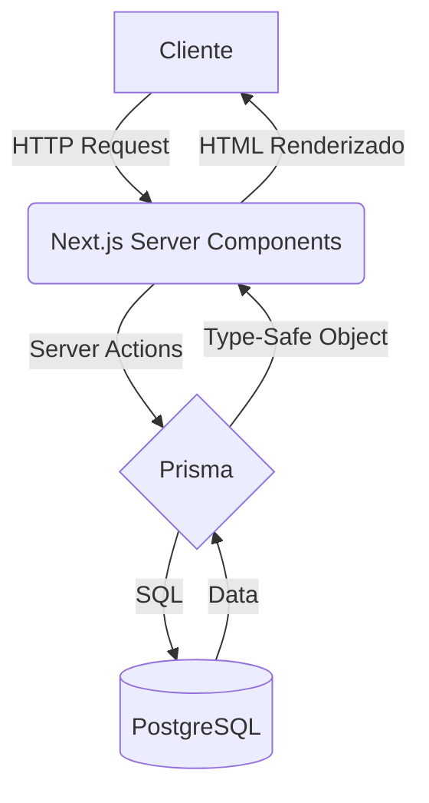
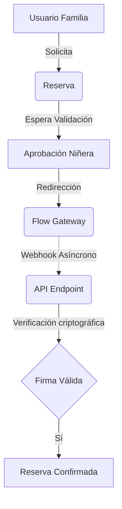

<div align="center">
  <h1>🏠 Refugia</h1>
  <p><strong>Plataforma B2C de conexión entre familias y cuidadoras infantiles.</strong></p>
</div>

---

## 🏗️ Arquitectura

**Refugia** (internamente NannyConnect) digitaliza el proceso de contratación de servicios de cuidado infantil. La plataforma gestiona el ciclo completo: búsqueda basada en geolocalización, validación de antecedentes, calendarización cruzada, mensajería condicional y pasarela de pago transaccional.

### Características Técnicas

* **Framework**: Next.js 16 (App Router) con renderizado híbrido (Server Components & Client Components).
* **Data Fetching**: Mutaciones mediante Server Actions para evitar endpoints API intermediarios.
* **Base de Datos**: PostgreSQL para manejo concurrente de transacciones y consistencia referencial.
* **ORM**: Prisma (Type-safe ORM).
* **Autenticación**: JWT mediante `NextAuth.js`. Contraseñas hasheadas (Bcrypt, 12 rounds).
* **Control de Acceso (RBAC)**: Evaluación de JWT en el borde (Edge) mediante `next-auth/middleware`.

### Métricas de Ingeniería
* **> 15 Entidades Prisma** modelando el dominio del negocio.
* **RBAC para 3 dominios** aislados (`FAMILY`, `NANNY`, `ADMIN`).
* **> 30 Server Actions** encapsulando la lógica de negocio.
* **Sistema transaccional completo** con manejo de fallos y soft-deletes.
* **Integración con 3 APIs externas** de manera asíncrona.

---

## 📈 Escalabilidad

La arquitectura del sistema está diseñada para soportar crecimiento y concurrencia bajo las siguientes características:

* **Stateless Authentication**: Uso exclusivo de JWT, eliminando la necesidad de almacenamiento de sesiones en memoria y facilitando el escalamiento horizontal.
* **Horizontal Scaling**: Contenedores aislados en Docker que permiten orquestación y balanceo de carga.
* **Reverse Proxy**: NGINX pre-configurado para manejar el tráfico, compresión GZIP y terminación SSL.
* **Asynchronous Processing**: Webhooks para pagos y notificaciones, previniendo el bloqueo del event loop principal.
* **Multi-domain Ready**: Estructura de base de datos preparada para expansión regional mediante segregación de locaciones geográficas.

---

## 🧩 Integraciones

* **Flow.cl**: Webpay y métodos locales a través de webhooks seguros.
* **Resend API**: Envío de emails transaccionales HTML.
* **NextAuth**: Gestión de sesiones e identidad.
* **Prisma**: Capa de abstracción de datos.
* **PostgreSQL**: Motor relacional primario.

---

## 📊 Diagramas de Sistema

### Flujo de Datos


### Ciclo de Vida de Reservas


---

## 🎯 Engineering Challenges

Resolución de dominios de negocio complejos en funcionalidades técnicas:

* **Matching Geográfico**: Cálculo radial basado en coordenadas (anonimizadas en frontend por seguridad) para determinar la cobertura efectiva entre proveedor y cliente.
* **Double Booking Prevention**: Motor de disponibilidad que intersecta bloques bloqueados manualmente, horarios fijos de trabajo y reservas pre-existentes para evitar colisiones temporales.
* **Webhooks Transaccionales**: Integración asíncrona de pagos con sistema de fallbacks y un *cron job* implementado para limpiar reservas estancadas en estados pendientes de pago.
* **Role Based Access Control (RBAC)**: Middleware perimetral que intercepta requests cruzados entre dominios (`/admin`, `/family`, `/nanny`), abortando la navegación antes de tocar la lógica del servidor.
* **Chat Contextual**: Instanciación dinámica de salas de chat que requieren obligatoriamente una relación de base de datos `CONFIRMED` o `IN_CHAT` entre las partes, asegurando el encapsulamiento de la comunicación.
* **Dockerización Total**: Orquestación en `docker-compose` de bases de datos y reverse proxies para eliminar discrepancias entre el entorno de desarrollo y producción.

---

## 🛠️ Deploy & Setup Local

### Entorno de Producción (VPS)
Configuración optimizada para Docker:
```bash
git clone https://github.com/nicvroyz/nannyconnect.git
cd nannyconnect
cp .env.example .env
# Levantar infraestructura (App + DB + NGINX)
docker-compose up -d --build
# Migraciones
docker exec -it nannyconnect_app npx prisma migrate deploy
```

### Entorno de Desarrollo
```bash
npm install
npx prisma generate
npx prisma db push
npm run dev
```